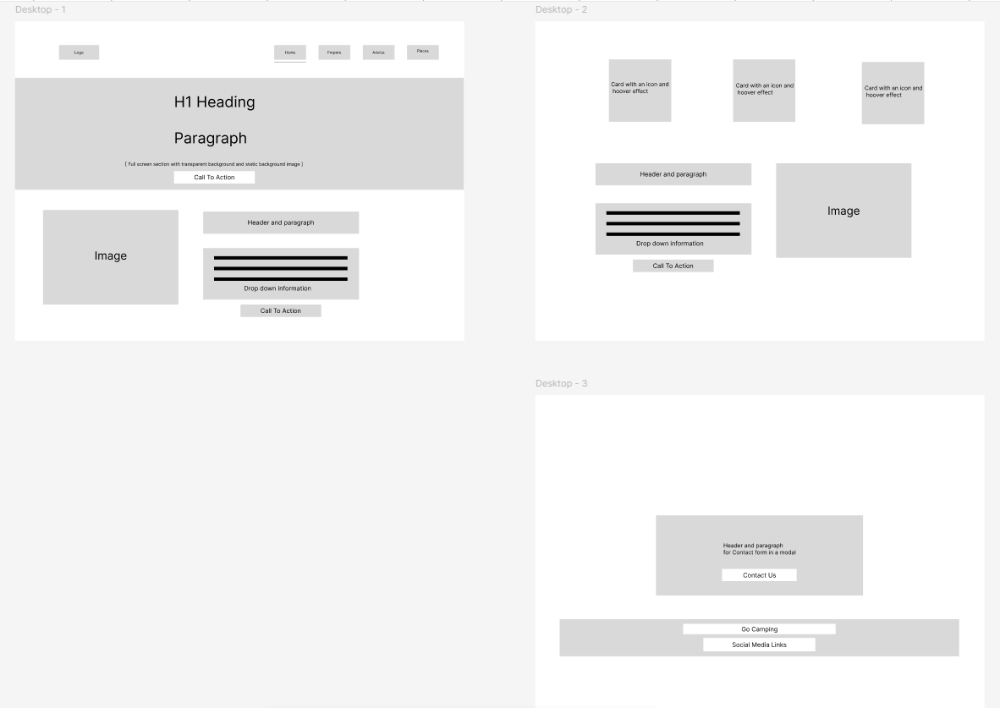
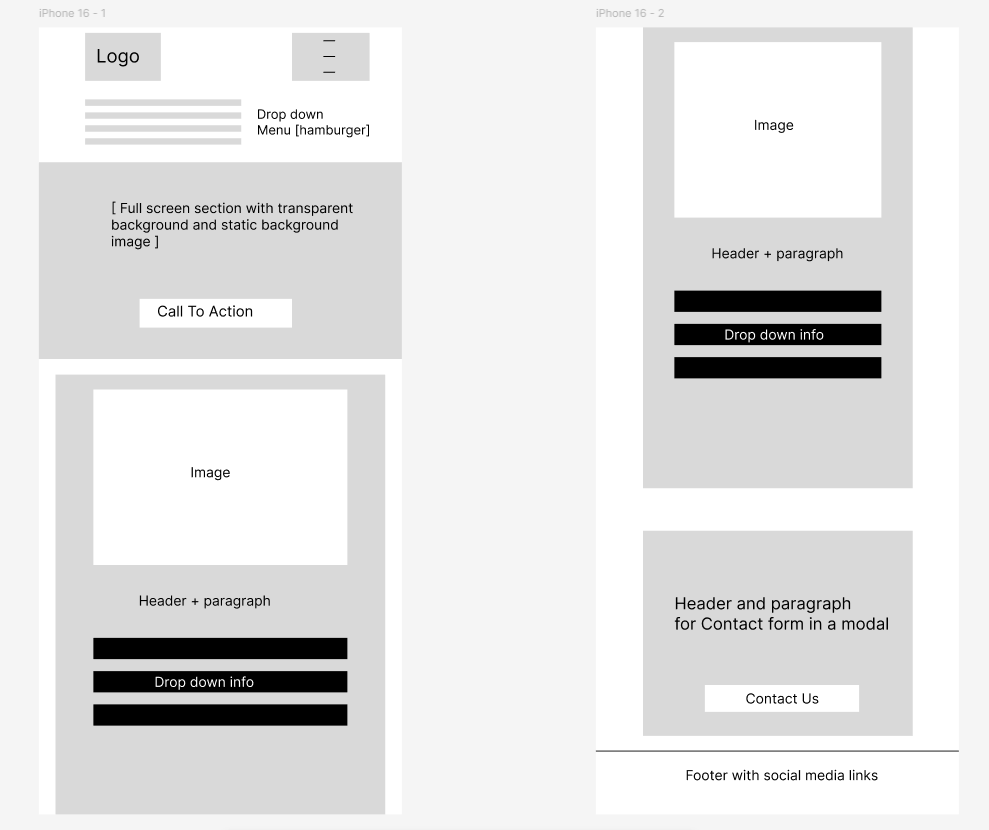
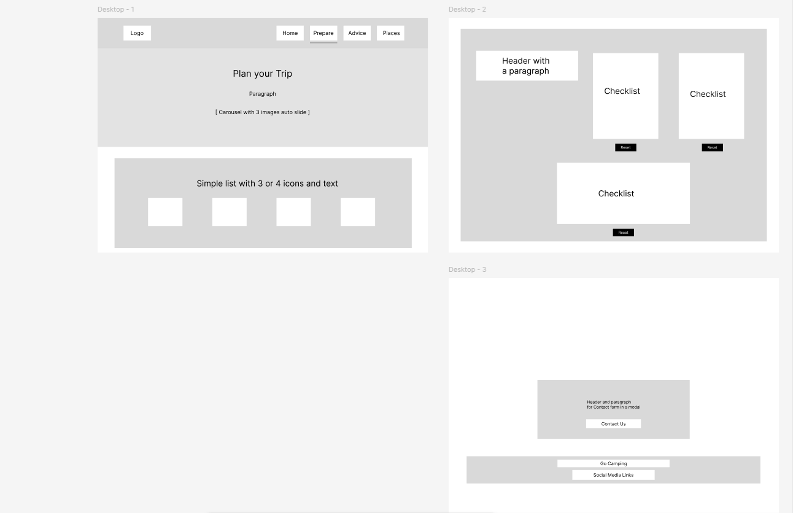
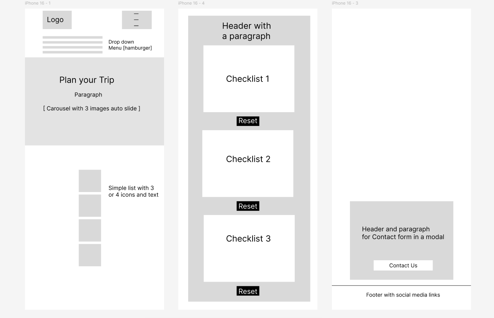
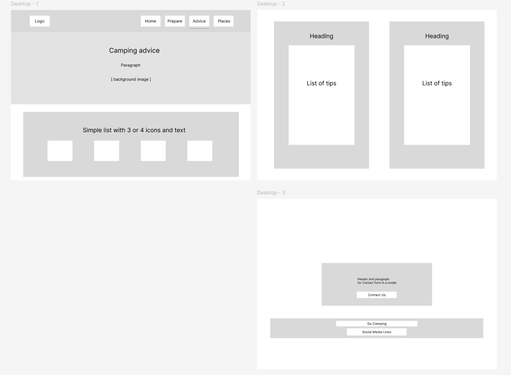
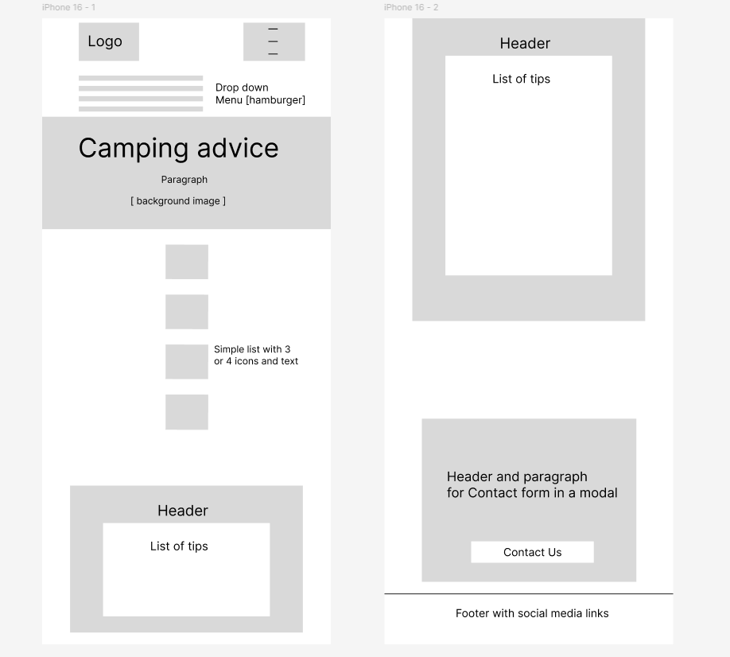
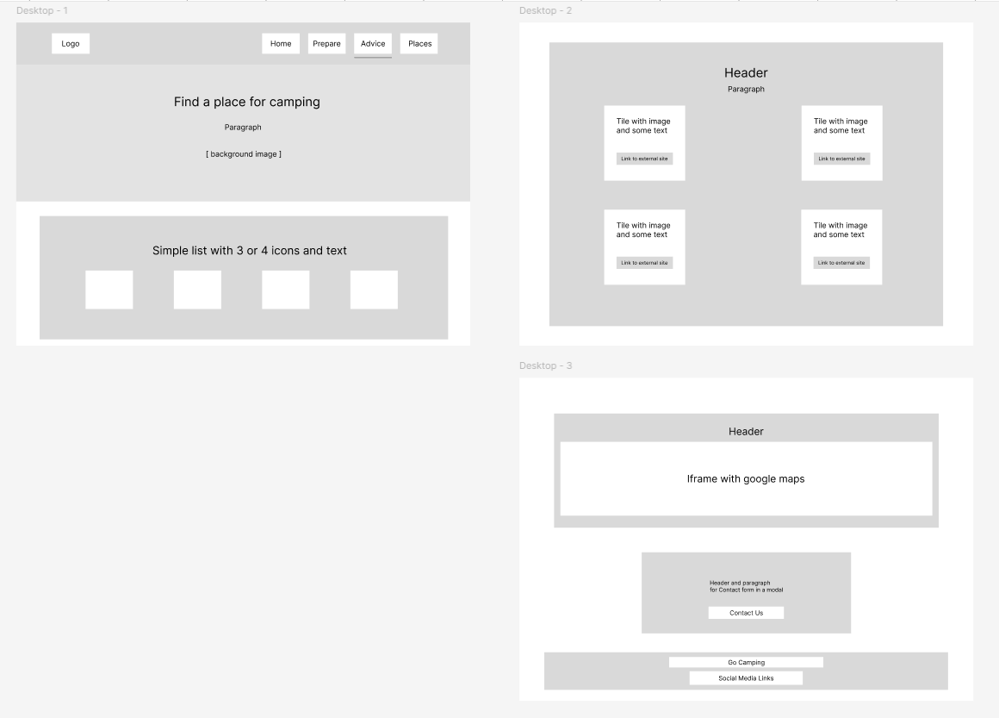
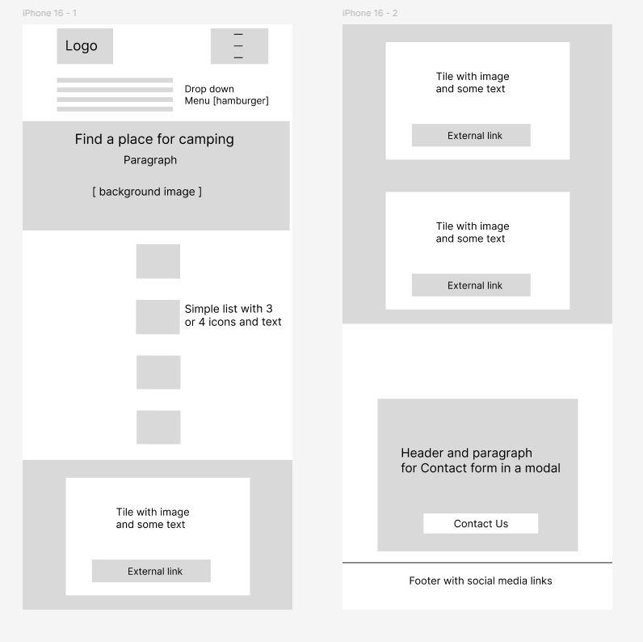

# Go Camping – Figma Designs & Wireframes

This document outlines the design planning process for the **Go Camping** website. Figma was used to create wireframes and mockups for both **desktop and mobile layouts**, helping define structure, spacing, and content hierarchy before development.

---

## Purpose of Figma Designs

Figma designs were created to:
- Plan page layouts before coding
- Test responsive behaviour on different screen sizes
- Ensure consistency across all pages
- Improve overall user experience

---

## Pages Designed

# Go Camping – Figma Designs & Wireframes

This document presents the Figma wireframes and mockups used during the
planning stage of the **Go Camping** website. Designs were created for both
desktop and mobile views to guide layout decisions and ensure responsive
behaviour before development.

---

## Home Page

### Desktop View

### Mobile View

---

## Prepare Page

### Desktop View

### Mobile View

---

## Advice Page

### Desktop View

### Mobile View

---

## Places Page

### Desktop View

### Mobile View

---

## Design Notes

- Wireframes focused on clarity and beginner‑friendly navigation
- Content sections were broken into structured blocks
- Call‑to‑action buttons were placed consistently across layouts
- Mobile designs prioritised readability and ease of interaction

---

## Conclusion

Using Figma during the planning phase helped ensure that the final website
remained consistent, responsive, and accessible across different screen
sizes, while supporting a clear and logical user journey.

---
