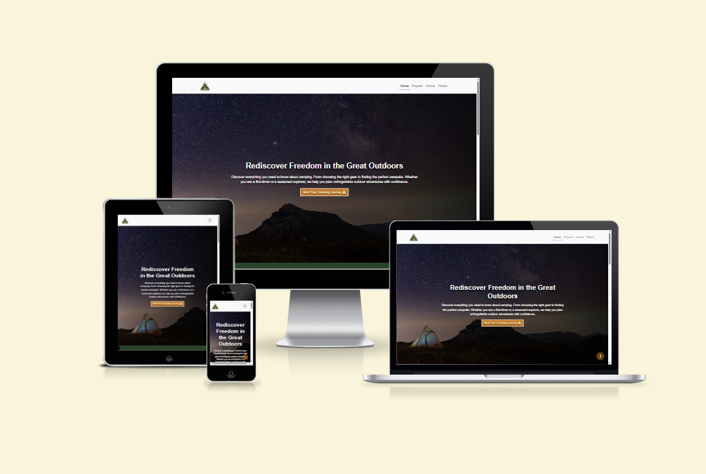

# Go Camping – First‑Time Camping Guide

Click **[LIVE SITE LINK](https://kaloyanjk.github.io/First-assignment-HTMLL-CSS-Bootstrap/index.html)** to view the deployed website.

---

## Table of Contents
- [Project Overview](#project-overview)
- [Project Updates](#project-updates)
- [Goals & Objectives](#goals--objectives)
- [Target Audience](#target-audience)
- [User Goals](#user-goals)
- [User Experience (UX)](#user-experience-ux)
- [User Stories](#user-stories)
- [Site Structure](#site-structure)
- [Design Decisions](#design-decisions)
- [Pages Overview](#pages-overview)
- [Technologies Used](#technologies-used)
- [AI Usage Declaration](#ai-usage-declaration)
- [Testing & Validation](#testing--validation)
- [Limitations & Future Improvements](#limitations--future-improvements)
- [Screenshots](#screenshots)

---

## Project Overview

**Go Camping** is a static, beginner‑focused website designed to support **first‑time campers in the UK**. The site explains what camping at organised campsites involves, how to prepare, and how to follow basic safety and etiquette rules. The main aim of the project is to **reduce anxiety** and help users feel confident before their first camping experience.

The website is built using **HTML, CSS, and Bootstrap**, following a **mobile‑first and accessibility‑aware** approach.

---

## Project Updates

- Fully responsive layout tested across all Bootstrap breakpoints
- Consistent navigation across all pages with active state indicators
- Accordion components added to reduce text overload for beginners
- Clear call‑to‑action buttons to guide users through the site
- Improved text contrast and readability on image backgrounds

---

## Goals & Objectives

- Explain what camping at an organised campsite is like
- Provide simple preparation guidance for beginners
- Reduce fear of doing something wrong
- Encourage confident and realistic expectations about camping

---

## Target Audience

- Complete beginners to camping
- UK residents planning their first campsite trip
- Users looking for clear, non‑technical guidance
- People feeling nervous about safety, equipment, or etiquette

---

## User Goals

- Understand campsite life and expectations
- Know what to bring and how to prepare
- Learn basic safety rules and campsite behaviour
- Navigate information easily on mobile and desktop

---

## User Experience (UX)

The site uses calm colours, clear spacing, and friendly language to reassure beginners. Content is broken into sections using accordions and cards to avoid overwhelming users. Each page provides a clear **“next step”** to guide the user through the journey.

---

## User Stories

**User Story 1**  
As a first‑time camper, I want to understand what camping involves, so I can decide if it is right for me.

**User Story 2**  
As a beginner, I want a simple preparation guide, so I know what to pack.

**User Story 3**  
As a nervous camper, I want to learn safety and etiquette rules, so I don’t worry about doing something wrong.

---

## Site Structure

Primary user flow:  
**Home → Prepare → Advice → Places**

Each page can be accessed independently but is designed to work as a clear learning sequence.

---

## Design Decisions

### Colour Palette
- Forest green for trust and nature
- Earth tones for stability
- Orange accents for calls to action
- Neutral backgrounds for readability

### Typography
- System sans‑serif fonts for accessibility
- Clear heading hierarchy
- Comfortable line‑height

### UI Components
- Accordions to manage information density
- Cards to highlight benefits and topics
- Clear buttons guiding progression

---

## Pages Overview

### Home – *Is Camping for You?*
- Introduction and reassurance content
- Accordion sections explaining camping basics
- CTA linking to preparation page

### Prepare – *What to Pack & How to Get Ready*
- Beginner checklist and preparation guidance
- Essentials vs optional items
- Interactive checklist layout

### Advice – *Safety & Campsite Etiquette*
- Safety rules explained simply
- Environmental responsibility
- Reassurance for common worries

### Places – *Where to Camp*
- Embedded Google Maps iframe showing beginner‑friendly camping locations across the UK
- Visual exploration of campsites before planning a trip
- Highlights key UK regions such as England, Wales, and Scotland

---

## Technologies Used

- **HTML5** – semantic page structure
- **CSS3** – custom styling and layout control
- **Bootstrap 5** – responsive grid and UI components

---

## AI Usage Declaration

AI tools were used as **support only**, primarily for:
- Logo generation
- Clarifying Bootstrap behaviour
- Structuring documentation
- Content generation

All generated content was reviewed, edited, and adapted.

Tools used:
- **[COPILOT](https://copilot.microsoft.com/)**

---

## Testing & Validation

Testing details, screenshots, and validation results are documented in a separate file:

➡ **[VIEW VALIDATION REPORT](VALIDATIONS.md)**

---

## Limitations & Future Improvements

### Limitations
- No backend or form processing
- Static content only
- Beginner‑level depth by design

### Future Improvements
- FAQ page for common questions
- Downloadable PDF packing checklist
- Subtle UI animations
- Beginner confidence quiz

---

## Screenshots

### Homepage
- [HOMEPAGE 320PX](assets/images/screenshots/)
- [HOMEPAGE 768PX](assets/images/screenshots/)
- [HOMEPAGE 1400PX](assets/images/screenshots/)

### Prepare Page
- [PREPARE PAGE](assets/images/screenshots/)

### Advice Page
- [ADVICE PAGE](assets/images/screenshots/)

---
