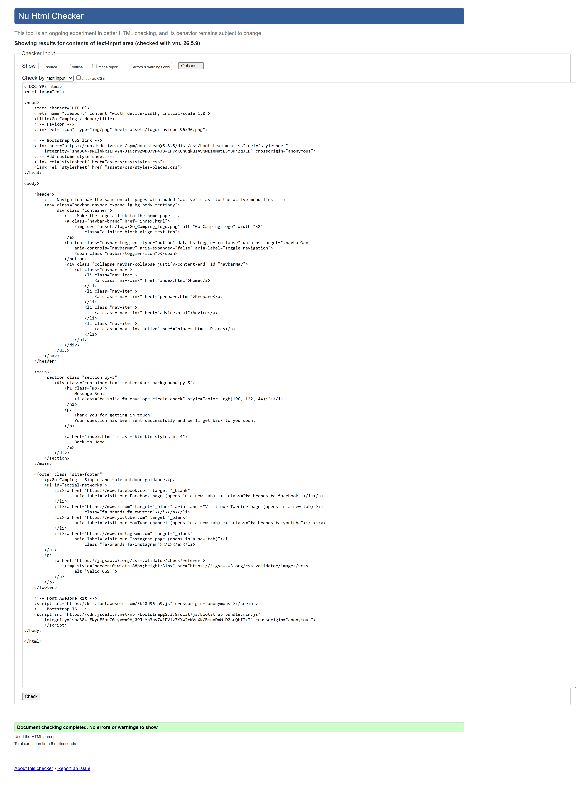
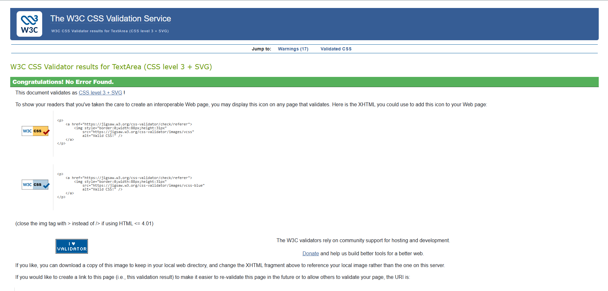
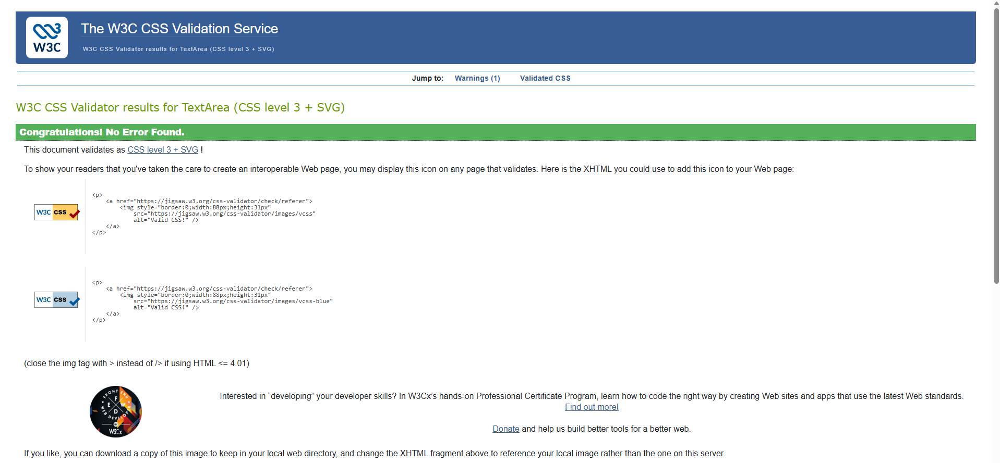
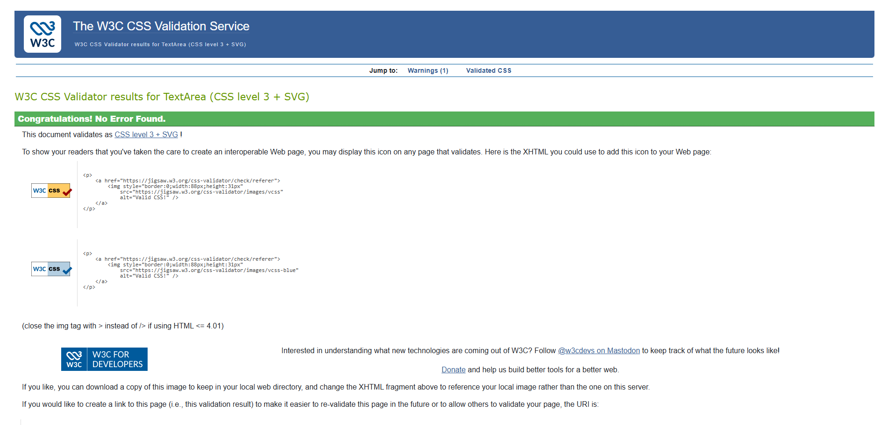
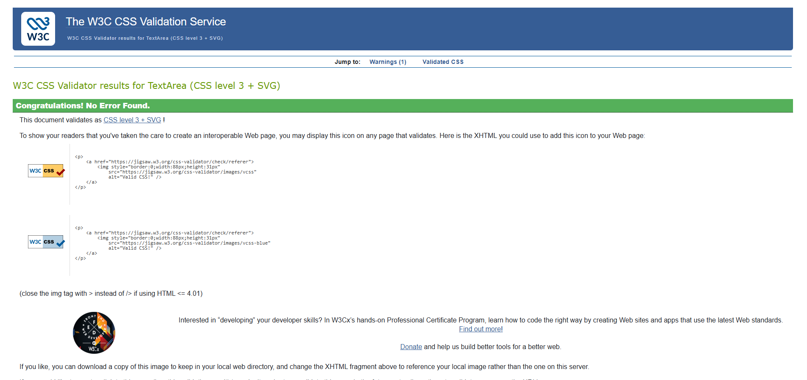

# Go Camping – Testing & Validation Report

This document outlines the testing process and validation results for the **Go Camping** website. Validation was carried out using W3C validation tools and manual accessibility and responsiveness checks.

---

## HTML Validation

All main pages were validated using the **W3C HTML Validator**. Validation was performed by URI after deployment to GitHub Pages. No critical HTML errors were found.

### Validation Evidence

#### Home Page

#### Prepare Page

#### Advice Page

#### Places Page

#### Success Page

---

## CSS Validation

Custom stylesheets were tested using the **W3C CSS Validator**. No errors were detected. Any warnings were related to vendor prefixes and external frameworks, which are acceptable for compatibility purposes.

### Validation Evidence

#### Main Stylesheet

#### Prepare Page Stylesheet

#### Advice Page Stylesheet

#### Places Page Stylesheet

---

## Accessibility Testing

Accessibility testing was carried out using a combination of **Lighthouse audits** and **manual keyboard navigation tests**.

The following checks were performed:
- Keyboard navigation using the Tab key
- Visible focus states for interactive elements
- Alt text provided for all images
- Labels correctly associated with form inputs
- Logical heading hierarchy across all pages

---

## Responsive Testing

The website was tested across multiple screen sizes using browser developer tools to ensure responsive behaviour and layout consistency.

### Breakpoints Tested
- 320px (Mobile)
- 576px (Small devices)
- 768px (Tablets)
- 992px (Small desktops)
- 1200px (Large desktops)
- 1400px (Extra large screens)

---

## Lighthouse Testing Summary

Google Lighthouse was used to perform audits covering **Performance, Accessibility, Best Practices, and SEO**.  
Tests were run in a private browser window to minimise the impact of extensions.

Minor performance warnings were mainly related to image optimisation and third‑party frameworks (Bootstrap and Font Awesome), which are acceptable for a static Bootstrap‑based project.

Accessibility, Best Practices, and SEO scores were consistently high, confirming that the website meets modern front‑end standards.

---

## Lighthouse Report Evidence

### Home Page

#### Desktop View

#### Mobile View

---

## Conclusion

The **Go Camping** website meets validation, accessibility, and responsiveness requirements appropriate for a static HTML, CSS, and Bootstrap project. All core pages validated successfully, and usability testing confirms the site is accessible and responsive across devices.
